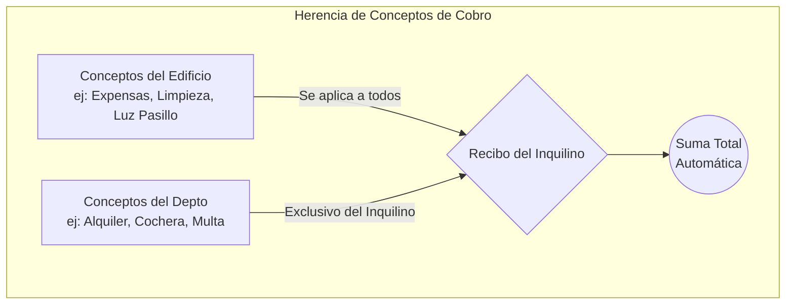

# Mi-Admin: Gestor de Recibos Inmobiliarios 🏢📄

**Mi-Admin** es una aplicación de escritorio profesional desarrollada en Python y PyQt6 diseñada para administrar la cobranza, facturación y control de recibos de edificios y departamentos de forma 100% autónoma.

---

## 🌟 Características Principales

* **Cobranza Jerárquica Automática:** Combinación de gastos fijos del edificio con gastos particulares del departamento al instante.
* **Plantillas Excel Dinámicas:** Inyección directa de datos sobre cualquier archivo de Excel (`.xlsx`) usando mapeos visuales o etiquetas (`{{VARIABLES}}`).
* **Exportación en Lote:** Generación de recibos en formato nativo Excel y conversión automática a PDF, organizados en carpetas.
* **Base de Mapeos (Templates):** Posibilidad de guardar configuraciones de Excel internas para reutilizar en múltiples edificios con un solo clic.
* **Autoincremento Inteligente:** El sistema rastrea el número de recibo por cada departamento automáticamente sin intervención manual.
* **Portabilidad Absoluta:** No requiere instalación de servidores (usa SQLite3) y se distribuye como un único archivo `.exe` para Windows.

---

## 📘 Guía Rápida y Manual de Usuario

### 1. Gestión de Propiedades (Agregar, Editar, Eliminar)
El primer paso en Mi-Admin es configurar tus propiedades.
* **Crear Edificios:** Desde la "Configuración de Edificios", puedes agregar un nuevo edificio con su nombre y dirección. Aquí también configuras qué **Plantilla de Excel** utilizará.
* **Crear Departamentos:** Selecciona un edificio en el árbol de la izquierda y haz clic en `+ Depto al Edif`. Podrás establecer el nombre del inquilino, día de pago, fechas de contrato (Inicio/Fin) y establecer desde qué número de recibo quieres empezar.
* **Editar/Eliminar:** Simplemente selecciona el departamento o edificio de la lista. Podrás modificar cualquier valor y presionar "Guardar". Si decides usar el botón "🗑️ Eliminar" en un departamento, el sistema purgará todos los recibos y el historial asociado a él para mantener la base de datos limpia.

### 2. ¿Cómo funciona la Jerarquía de Conceptos?
El sistema evita que tengas que cargar el mismo concepto de cobro 20 veces. Se basa en una herencia inteligente:


**Ejemplo de uso:** Al configurar un Edificio, le asignas el concepto *"Luz Común: $500"*. Luego, a cada Departamento le asignas su valor de *"Alquiler"*. Cuando generas el recibo del mes, el sistema unifica automáticamente el Alquiler con los $500 de luz para todos.

### 3. Mapeo de Plantillas Excel (Templates)
En lugar de forzarte a usar un formato de recibo aburrido predeterminado, **Mi-Admin se adapta a tu propio diseño de Excel**.
1. En la configuración del Edificio, ve a **"Configurar Mapeo de Celdas"**.
2. Dile al sistema exactamente dónde imprimir cada cosa (Ej: "Columna de Total: C15", "Inquilino: B2").
3. **Guardar Mapeo:** Puedes presionar "Guardar como Nuevo Mapeo" para almacenar esta configuración.
4. **Reutilizar:** Al crear un nuevo edificio, no tienes que volver a escribir B2, C15, etc. Simplemente abres el menú desplegable superior, seleccionas tu mapeo guardado y todo se autocompletará.

---

## 🔄 Flujo de Trabajo Técnico del Sistema

A continuación se detalla el ciclo de vida de la información y cómo interactúan los tres módulos principales con la base de datos:


---

## 📂 Estructura del Código Fuente

Para desarrolladores interesados en colaborar o modificar el proyecto:

```text
Mi-Admin/
├── run.py                 <-- Lanzador del entorno de producción.
├── app/                   <-- Código fuente principal de la aplicación.
│   ├── __init__.py
│   ├── main_app.py        <-- Dashboard y orquestación de la GUI.
│   ├── core/              <-- Motor de procesamiento de datos y lógica.
│   │   ├── __init__.py
│   │   ├── database.py    <-- Interfaz SQLite (CRUD, Autoincrementos, Relaciones).
│   │   └── excel_manager.py <-- Lógica de inyección openpyxl y conversión a PDF.
│   └── ui/                <-- Formularios modulares de la interfaz.
│       ├── __init__.py
│       ├── gestion_ui.py  <-- Ventanas de propiedades, mapeo y plantillas.
│       └── config_ui.py   <-- Ventanas de configuraciones secundarias.
├── data/                  <-- Carpeta autogenerada: Almacena la DB portable.
└── recibos/               <-- Directorio de salida predeterminado para XLSX y PDF.
```

## 🛠️ Stack Tecnológico
* **Core:** Python 3.10+
* **Interfaz de Usuario:** PyQt6
* **Base de Datos:** SQLite3
* **Manipulación de Documentos:** `openpyxl` (Generación de Excel), LibreOffice/soffice (Motor headless para exportar a PDF).
* **Empaquetado y Distribución:** PyInstaller (Standalone Windows `GestorRecibos.exe`).
