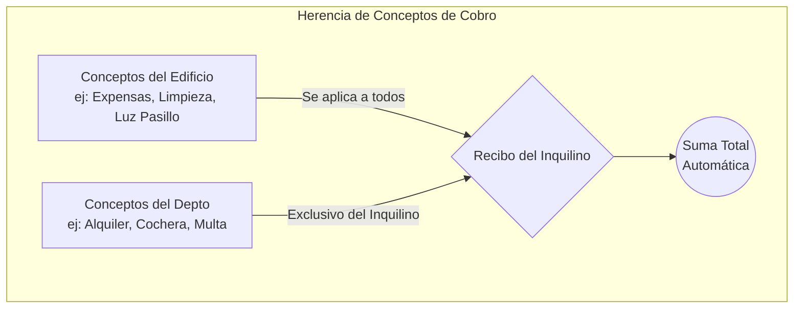
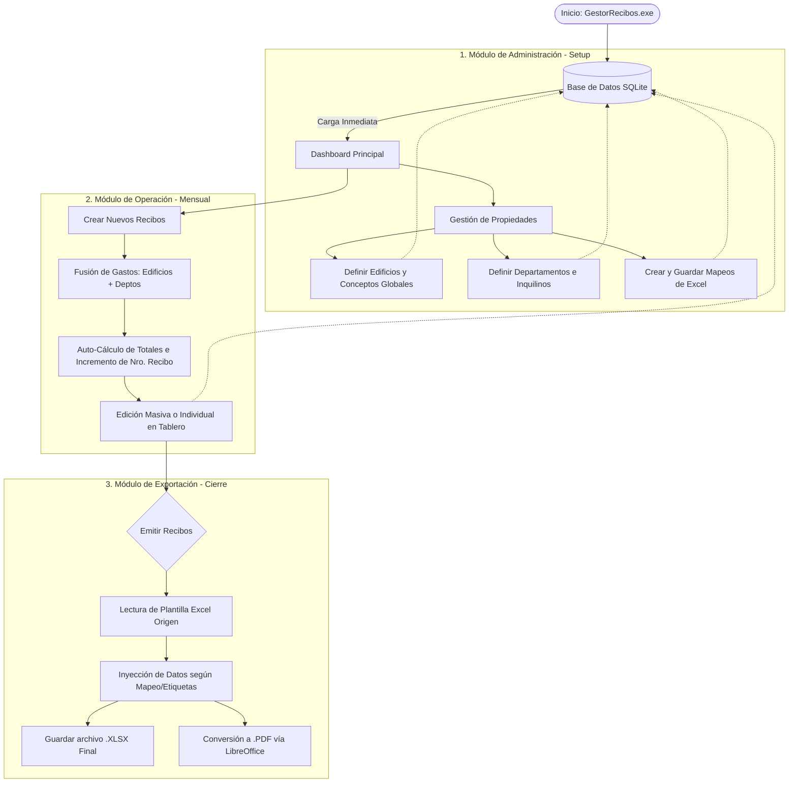

# Mi-Admin: Gestor de Recibos Inmobiliarios 🏢📄

<div align="center">
  <br>
  <a href="https://drive.google.com/file/d/1vcqliESwXU_84Vsl8sl5prSZR_VNXdQW/view?usp=sharing">
    
  </a>
  <br><br>
  <i>👆 Haz clic en el botón verde de arriba para descargar el programa listo para usar (No requiere instalación).</i>
  <br><br>
  <p><b>☕ ¿Te fue útil esta herramienta? ¡Puedes apoyar su desarrollo enviando una donación al alias: <code>guillermopetcho2</code>!</b></p>
  <br>
</div>

---

**Mi-Admin** es una aplicación de escritorio profesional desarrollada en Python y PyQt6 diseñada para administrar la cobranza, facturación y control de recibos de edificios y departamentos de forma 100% autónoma.

---

## 🌟 Características Principales

* **Cobranza Jerárquica Automática:** Combinación de gastos fijos del edificio con gastos particulares del departamento al instante.
* **Plantillas Excel Dinámicas:** Inyección directa de datos sobre cualquier archivo de Excel (`.xlsx`) usando mapeos visuales o etiquetas (`{{VARIABLES}}`).
* **Exportación en Lote:** Generación de recibos en formato nativo Excel y conversión automática a PDF, organizados en carpetas.
* **Base de Mapeos (Templates):** Posibilidad de guardar configuraciones de Excel internas para reutilizar en múltiples edificios con un solo clic.
* **Autoincremento Inteligente:** El sistema rastrea el número de recibo por cada departamento automáticamente sin intervención manual.
* **Portabilidad Absoluta:** No requiere instalación de servidores (usa SQLite3) y se distribuye como un único archivo `.exe` para Windows.

---

## 📘 Guía Rápida y Manual de Usuario

### 1. Gestión de Edificios y Departamentos (CRUD Completo)
El módulo "Administrar Propiedades" es el corazón del sistema. Aquí puedes llevar el control absoluto de tus inquilinos:

* **🏗️ Crear un Edificio:** 
  1. Presiona el botón `+ Nuevo Edificio` en el panel izquierdo.
  2. Llena su "Nombre" (Ej: *Torres del Sol*), "Dirección" y asigna la ruta del archivo `.xlsx` (Plantilla de Excel pre-diseñada) que se usará para generar los recibos.
  3. Haz clic en **Guardar Edificio**.
* **🚪 Agregar un Departamento a un Edificio:**
  1. En el árbol de navegación izquierdo, selecciona primero el edificio al que le quieres agregar el departamento.
  2. Presiona `+ Depto al Edif.`.
  3. Llena los datos del inquilino: *Identificador (Ej: 1A)*, *Nombre del Inquilino*, *Inicio y Fin de Contrato*, y *Día de Vencimiento*.
  4. Configura el **Nro de Recibo Inicial** (por defecto es 1). El sistema sumará +1 automáticamente a este número cada mes que generes un recibo.
  5. Haz clic en **Guardar Departamento**.
* **✏️ Editar Información:** Selecciona cualquier elemento en el árbol de la izquierda, cambia los textos en el formulario de la derecha y dale a "Guardar".
* **🗑️ Sistema de Eliminación Seguro (Papelera):**
  * **Eliminar Departamento:** Haz clic en "🗑️ Eliminar". Esto pedirá confirmación y moverá al inquilino, junto con todos sus recibos y el historial de cobros, a la Papelera para mantener la base de datos veloz y limpia.
  * **Eliminar Edificio Completo:** Por seguridad extrema, para eliminar un edificio entero deberás escribir literalmente `ELIMINAR NOMBRE_DEL_EDIFICIO` en la ventana de confirmación.
  * **Restauración/Auditoría:** En el panel izquierdo tienes el botón **🗑️ Papelera**. Al hacer clic, podrás ver en código crudo (`JSON`) todos los datos que fueron borrados, junto con la fecha y hora exacta de su eliminación, por si hubo algún error humano y requieres auditarlo.

### 2. ¿Cómo funciona la Jerarquía de Conceptos?
El sistema evita que tengas que cargar el mismo concepto de cobro repetidas veces. Se basa en una herencia inteligente:


**Ejemplo de uso:** Al configurar un Edificio, entras a **"Configurar Conceptos Generales"** y agregas *"Luz Común: $5000"*. Luego, seleccionas el Departamento 1A, entras a **"Configurar Conceptos Particulares"** y agregas *"Alquiler: $150000"*. Al generar el recibo del mes, Mi-Admin los fusiona para crear un borrador total a cobrar de $155000.

### 3. Macros y Mapeo de Plantillas Excel (Templates)
**Mi-Admin se adapta a tu propio diseño de Excel, no al revés.** Tienes dos formas de vincular la base de datos a tus archivos para imprimirlos:

* **A) Por Mapeo de Celdas (Coordenadas Exactas):**
  1. En la configuración del Edificio, ve a **"Configurar Mapeo de Celdas"**.
  2. Escribe la coordenada donde quieres que vaya la información. Ejemplo: Si quieres que el nombre del inquilino aparezca en la celda `B4`, escribe `B4` en el campo "Inquilino". Si tu lista de gastos empieza en la fila `15`, pones `15` en "Fila" y `C` en la Columna de Precio.
* **B) Por Etiquetas Inteligentes (Macros/Tags):**
  * Si prefieres no usar coordenadas, simplemente abre tu plantilla de Excel y escribe en cualquier lugar las siguientes etiquetas. El sistema las reemplazará automáticamente al exportar el recibo:
  `{{NUMERO_RECIBO}}`, `{{INQUILINO}}`, `{{DEPARTAMENTO}}`, `{{EDIFICIO}}`, `{{PERIODO}}`, `{{FECHA}}`, `{{INICIO_CONTRATO}}`, `{{FIN_CONTRATO}}`, `{{TOTAL}}`.

**♻️ Guardar y Reutilizar Mapeos (Plantillas Internas):**
Una vez que mapeaste todas tus celdas (`B4`, `C5`, `H15`...):
1. Haz clic en **"Guardar campos actuales como Nuevo Mapeo..."** e inventa un nombre (Ej: *Plantilla de Expensas Tipo A*).
2. Cuando des de alta un segundo Edificio, no tendrás que tipear las coordenadas de nuevo. Simplemente despliegas la lista **"Mapeos Guardados"** en la parte superior, seleccionas esa plantilla y ¡todos los campos se autocompletarán mágicamente!

### 4. Configuración del Sistema (Ajustes Globales)
El botón "⚙️ Configuración" en la pantalla principal te permite personalizar el comportamiento general de todo el programa. Este panel está dividido en 4 pestañas:

1. **🏢 Empresa:** Aquí cargas los datos de tu administración (Nombre o Razón Social, Dirección, Teléfono y Email). Estos datos se guardan en la base de datos y en el futuro podrán ser usados para membretes automáticos.
2. **🎨 Apariencia:** 
   * **Tema Visual:** Te permite elegir entre un Modo Claro (por defecto) o un Modo Oscuro (nocturno) para reducir la fatiga visual.
   * **Símbolo de Moneda:** Configura cómo quieres que se muestre el dinero en el sistema (Pesos `$`, Dólares `U$D` o Euros `€`).
3. **📁 Rutas y Archivos:**
   * **Carpeta de Recibos:** Selecciona en qué carpeta de tu computadora quieres que se guarden todos los recibos exportados.
   * **Formato de Salida:** Elige si quieres que el programa solo te exporte los archivos `.xlsx` rellenados, o si prefieres el ciclo completo `Excel y PDF` (el sistema exportará el Excel y luego usará LibreOffice en segundo plano para convertirlo a un PDF inmodificable).
4. **💬 Comunicaciones:** Escribe una plantilla o borrador de mensaje para enviar por WhatsApp. *(Ej: "Hola, adjunto el recibo de tu alquiler correspondiente al mes...")*. Esta pestaña dejará todo preparado para las futuras integraciones de envío automatizado.

### 5. Cómo Generar, Editar y Exportar Recibos
El botón verde y gigante **"Generar Recibos"** en el panel principal es inteligente y tiene una doble función (Borrador -> Exportación) dependiendo de qué selecciones en la pantalla:

* **Fase 1: Creación de Borradores (Tildar a la Derecha)**
  1. En el árbol de la derecha ("Edificios y Departamentos"), haz clic en las casillas (checkboxes) de los inquilinos a los que les quieres facturar este mes. Puedes tildar un edificio entero para seleccionar todos sus departamentos de golpe.
  2. Haz clic en **Generar Recibos**.
  3. El sistema fusionará los conceptos, sumará los precios, calculará todo, avanzará un número el contador del inquilino y creará los recibos en estado **Borrador**. Estos aparecerán instantáneamente en la tabla de la izquierda.
* **Fase 2: Edición y Control (Tabla de la Izquierda)**
  1. Haz clic sobre uno o varios de los recibos que acaban de aparecer en la tabla izquierda.
  2. En el panel inferior verás el detalle exacto: Puedes hacer doble clic en el precio o la cantidad de cualquier ítem para modificarlo al vuelo (Ej: Si este mes le cobras un recargo extra). También puedes editar el Período, la Fecha o sumarle una "Nota" (haciendo clic en el ícono 📝 de la tabla).
  3. *Tip: Si haces clic derecho sobre un recibo, podrás eliminarlo o duplicarlo.*
* **Fase 3: Emisión Final y Exportación (Seleccionar a la Izquierda)**
  1. Cuando los borradores estén listos y verificados, simplemente selecciónalos haciendo clic (o arrastrando el ratón) sobre ellos en la tabla de la izquierda.
  2. Vuelve a hacer clic en el botón verde gigante **Generar Recibos**.
  3. ¡Magia! El sistema tomará cada recibo, abrirá tu plantilla de Excel sin que lo notes, inyectará todos los datos en sus coordenadas, lo guardará en tu carpeta de Recibos y (si lo configuraste así) lo convertirá a un PDF inviolable listo para enviar.

---

## 🔄 Flujo de Trabajo Técnico del Sistema

A continuación se detalla el ciclo de vida de la información y cómo interactúan los tres módulos principales con la base de datos:



---

## 📂 Estructura del Código Fuente

Para desarrolladores interesados en colaborar o modificar el proyecto:

```text
Mi-Admin/
├── run.py                 <-- Lanzador del entorno de producción.
├── app/                   <-- Código fuente principal de la aplicación.
│   ├── __init__.py
│   ├── main_app.py        <-- Dashboard y orquestación de la GUI.
│   ├── core/              <-- Motor de procesamiento de datos y lógica.
│   │   ├── __init__.py
│   │   ├── database.py    <-- Interfaz SQLite (CRUD, Autoincrementos, Relaciones).
│   │   └── excel_manager.py <-- Lógica de inyección openpyxl y conversión a PDF.
│   └── ui/                <-- Formularios modulares de la interfaz.
│       ├── __init__.py
│       ├── gestion_ui.py  <-- Ventanas de propiedades, mapeo y plantillas.
│       └── config_ui.py   <-- Ventanas de configuraciones secundarias.
├── data/                  <-- Carpeta autogenerada: Almacena la DB portable.
└── recibos/               <-- Directorio de salida predeterminado para XLSX y PDF.
```

## 🛠️ Stack Tecnológico
* **Core:** Python 3.10+
* **Interfaz de Usuario:** PyQt6
* **Base de Datos:** SQLite3
* **Manipulación de Documentos:** `openpyxl` (Generación de Excel), LibreOffice/soffice (Motor headless para exportar a PDF).
* **Empaquetado y Distribución:** PyInstaller (Standalone Windows `GestorRecibos.exe`).
